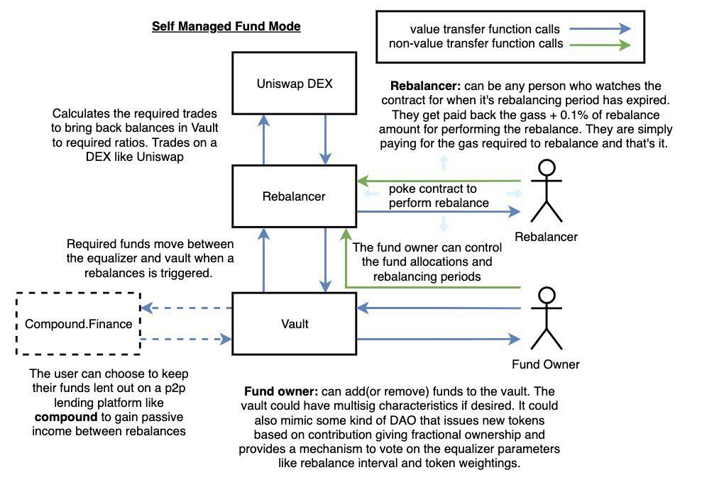

<div align="center">
    
    <h4>
        Snap a fund into existence
    </h4>
    <sub>A snapFund allows you to create a portfolio of various ERC20 tokens, specifying the percentage ratios you would like to maintain between them.
    </sub>
    <p>
        <br>
        A mechanism to create automatically rebalancing crypto funds in a decentralized and trust-less manor. Leveraging decentralized exchanges for automated value rebalancing and on chain peer to peer lending platforms to provide passive income for fund holders.
        The model presented bellow assumes that each user has their own fund and that they manage it in it’s entirety. This use case would be a user who has a collection of different cryptos and wants to specify a fixed ratio between them in value. They dont want to just buy a token from setprotocol or crypto20 as they then have no control over what is within the fund.<br><br>
        The general principle could be extended to a DAO where tokens are issued based on contribution and the DAO controls the parameters of the fund such as its composition and rebalancing period. There are lots of complex things that then must be considered however such as front running the fund, using the fund to buy up your own token and other game theory considerations that are outside the core idea of the hackathon.
        <br>
    </p>
    
</div>

#### Getting Snap running locally 

###### Requirements
Vyper Requirements
Pre requisite: [python3](https://www.python.org/download/releases/3.0/)
1. Set up a virtual environment 
```
$ pip3 install virtualenv
$ virtualenv -p python3 env
$ source env/bin/activate
```
2. Install dependencies
```
pip install -r requirements.txt
```
Pre requisite: [truffle](https://truffleframework.com/)
Pre requisite: [ganache](https://truffleframework.com/ganache)
Pre requisite: [yarn](https://yarnpkg.com/lang/en/docs/install/#windows-stable)
3. Run yarn
```
yarn
```
###### Testing
To test the contracts, run:
```
truffle test --migrations_directory migrations_null
```
To get the front end running locally, run:
```
yarn serv
```

Have a balanced time!
<div align="center">
    
</div>
